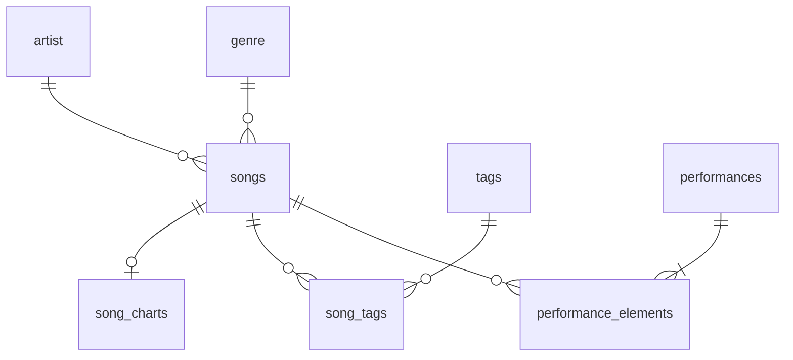

# IDEA Robust: setlist del Ministerio de Alabanza

Empezó como la migración de la base de datos de canciones de Notion a PostgreSQL. Hoy es la herramienta para llevar el catálogo de canciones, armar el setlist de cada domingo y consultar estructura y acordes.

## Este proyecto integra 3 partes
1. **Base de datos en PostgreSQL**: canciones, artistas, géneros, etiquetas, servicios (setlists) y charts (estructura y acordes).
2. **Dashboard en Streamlit**: páginas públicas de consulta y el reporte del setlist del domingo.
3. **Panel de administrador** (dentro del mismo dashboard): para agregar canciones, etiquetas, registrar setlists y editar charts. Reemplaza al programa de CLI que se usaba antes para subir el setlist.

Además, en `etl/` están los scripts que se usaron una sola vez para migrar los datos desde Notion.

## Arquitectura de Despliegue y Seguridad (Homelab V1)
El proyecto se despliega en un entorno de homelab autoalojado sobre **Proxmox** utilizando una arquitectura de contenedores anidados (**Nested LXC**).

### Componentes de la Arquitectura
1. **Entorno de Virtualización (Proxmox + Nested LXC)**:
   * Se utiliza un contenedor LXC en Proxmox configurado con soporte para anidación (*nesting*).
   * Dentro de este contenedor LXC se ejecuta el motor de **Docker**.
2. **Servicios de Docker (Docker Compose)**:
   * **Contenedor `db` (PostgreSQL)**: Almacena la base de datos relacional y expone el puerto para la ejecución local del ETL.
   * **Contenedor `dashboard` (Streamlit)**: Servidor de la aplicación web interactiva que se conecta de manera directa y segura al contenedor `db`.
3. **Acceso y Seguridad (Cloudflare Tunnel)**:
   * Toda la comunicación externa hacia el dashboard se canaliza a través de un **Cloudflare Tunnel** seguro.
   * Esto permite acceder a la aplicación desde internet sin abrir puertos en el router del hogar, garantizando encriptación de extremo a extremo y la posibilidad de añadir autenticación (por ejemplo, Cloudflare Access o mTLS) en la capa del túnel.


## Objetivo
Tener control histórico de las canciones que se tocan en los servicios y poder sacar métricas de:
1. Cuántas veces se ha tocado una canción a lo largo del tiempo, y cuáles no se han tocado en semanas.
2. Un control estricto sobre los registros (validaciones en los modelos antes de guardar).
3. Un mejor manejo de la información desde el dashboard.

## Estructura del repositorio
```text
dashboard/
  dashboard.py            Página de inicio (KPIs y gráficas)
  pages/
    consultas.py          Consulta y filtros de canciones
    setlist_domingo.py    Reporte del setlist del próximo domingo
    queries.py            Panel de administrador
  .streamlit/config.toml  Tema del dashboard
models/
  models.py               Modelos SQLAlchemy y sus validaciones
  chords.py               Parser de acordes (ChordPro) y transposición
  structure.py            Parser de la estructura de la canción
  utils.py                Helpers de Streamlit (tablas, tarjeta de canción, fechas)
  tests/                  Pruebas con pytest
docker/
  Dockerfile, docker-compose.yml
  entrypoint.py           Genera .streamlit/secrets.toml a partir de las variables de entorno
  init/01-schema.sql      Esquema de la base de datos (se ejecuta al crear el volumen)
  migrations/             Scripts SQL para bases de datos ya existentes
etl/                      Migración única desde Notion (CSV)
```

## Modelo de datos
El esquema está en `docker/init/01-schema.sql` y los modelos en `models/models.py`.



### songs
| id | title | artist_id | genre_id | tempo | tone | link_yt |
|----|-------|-----------|----------|-------|------|---------|
| SERIAL | VARCHAR(60) | INT | INT | INT (> 0) | VARCHAR(10) | TEXT |

Tabla principal del catálogo.
- Tiene un constraint `UNIQUE (title, link_yt)` para evitar registrar la misma canción dos veces.
- El título se guarda en formato título (`Tu Nombre Es Dios`).
- `link_yt` debe ser un link de YouTube válido (watch, youtu.be, shorts, live, embed).
- `tone` debe ser uno de `TONALIDADES` (ver [Tonos](#tonos)).

### artist
| id | name |
|----|------|
| SERIAL | VARCHAR(60) único |

### genre
| id | name |
|----|------|
| SERIAL | VARCHAR(100) único |

También se le conoce como "estilo", es el ritmo que lleva la canción. Los modelos solo aceptan `Alabanza` y `Adoración`.

### performances
| id | played_at | service_type | notes |
|----|-----------|--------------|-------|
| SERIAL | DATE | VARCHAR(50) | TEXT |

Cada fila es un servicio (por defecto "Domingo"). Es la que lleva el registro histórico de cuándo se tocan las canciones.

### performance_elements
| id | performance_id | song_id | song_order | specific_key |
|----|----------------|---------|------------|--------------|
| SERIAL | INT | INT | SMALLINT | VARCHAR(10) |

Las canciones de cada servicio, en orden (`UNIQUE (performance_id, song_order)`). `specific_key` es opcional: el tono en que se tocó ese día si fue distinto al original. Al borrar un servicio se borran sus canciones.

### song_charts
| id | song_id | structure | chords | time_signature |
|----|---------|-----------|--------|----------------|
| SERIAL | INT | TEXT | TEXT | VARCHAR(10) |

Una por canción: la estructura lineal, los acordes por compás (sin letra) y el compás (`4/4`, `3/4`, `6/8`, ...). Ver [Formato de estructura y acordes](#formato-de-estructura-y-acordes).

### tags y song_tags
| tags.id | tags.name |
|---------|-----------|
| SERIAL | VARCHAR(50) único |

`song_tags (song_id, tag_id)` es la tabla intermedia muchos a muchos entre canciones y etiquetas.

## Páginas del dashboard
| Página | Qué hace |
|--------|----------|
| Inicio (`dashboard.py`) | Total de canciones, artistas y tonos; top 5 de artistas con más canciones, top 5 de tonos y canciones por género |
| Consultas | Filtra canciones (título, artista, género, tono, tempo, etiquetas, sin tocar en N semanas) y muestra la tarjeta de una canción a la vez |
| Setlist Domingo | Reporte del próximo domingo: una tarjeta por canción con tono, tempo, compás, estructura y acordes |
| Panel de administrador (`queries.py`) | Agregar canciones, asignar etiquetas, armar el setlist (genera el mensaje para WhatsApp) y registrarlo como servicio, y editar charts (tono, tempo, link, estructura, acordes y compás) |

Al panel de administrador se entra con el token en la URL: `?admin=<ADMIN_TOKEN>`.

En las tarjetas de canción, el selector **Transponer a** muestra los acordes en otro tono del mismo modo. Es solo de vista: no cambia la base de datos.

## Formato de estructura y acordes
### Tonos
Los tonos de las canciones usan bemoles y los menores se escriben con `-` en lugar de `m`:

```text
C  Db  D  Eb  E  F  Gb  G  Ab  A  Bb  B
C- Db- D- Eb- E- F- Gb- G- Ab- A- Bb- B-
```

Para pasar una base de datos vieja a esta notación está `docker/migrations/001_fix_tone_notation.sql`.

### Estructura (`models/structure.py`)
Partes separadas por `-`, con o sin espacios. Se guarda en mayúsculas y separada por ` - `:

```text
in-v1 - PC - PC'[2] - C2(2) - BR(4) - OUT -   →   IN - V1 - PC - PC'[2] - C2(2) - BR(4) - OUT
```

Cada parte es un nombre en letras, número opcional, primas opcionales y repeticiones entre `[]` o `()`. No se usan guiones dentro del nombre de una parte (`PRE-CORO` se separaría en `PRE` y `CORO`; usar `PC`).

### Acordes (`models/chords.py`)
Cifrado americano por compás, con o sin corchetes. Los acordes menores se pueden escribir con `-`, `m` o `min`; se guardan con `-`. Las secciones se escriben solas en una línea (`VERSO`, `Coro:`) o como directiva ChordPro (`{c: VERSO}`):

```text
VERSO
| G | C G | E- D | C |

PRE-CORO
| C | D | E- E-, D | C |
| A |
```

Se guarda normalizado en formato ChordPro:

```text
{c: VERSO}
| [G] | [C] [G] | [E-] [D] | [C] |
```

- Acordes con extensiones y bajo: `maj7`, `sus4`, `add9`, `7b9`, `dim`, `°`, `(#11)`, `D/F#`.
- `%` repite el compás anterior. La coma de `E-, D` se conserva.
- Un acorde inválido marca la línea con error (`Línea 2: acorde inválido 'H7'`) y no se guarda nada.

Al transponer, los acordes se escriben con sostenidos en tonos como G, D, A, E y B (y sus menores relativos) y con bemoles en F, Bb, Eb, C, etc.

## Migración desde Notion (histórico)
La base de datos original estaba en Notion, con estas columnas:

| Song | Artist | Genre | LastPlay | Tempo | TimesPlayed | Tone | link |
|------|--------|-------|----------|-------|-------------|------|------|

Tenía dos problemas:
1. **No tenía registro histórico** (la fecha en que se tocaba cada canción), así que el historial empezó desde cero con la migración. Ahora cada servicio se registra en `performances`.
2. **El CSV estaba lleno de valores vacíos** (48 canciones con uno o más campos vacíos). Se llenaron a mano con un script interactivo (`etl/clean_nan.py`).

La migración se hizo con `etl/etl_db.py`: lee `etl/Setlist_completo.csv`, limpia artistas y géneros, y sube las canciones completas. Las filas con valores vacíos se guardan aparte para revisarlas. Las columnas `LastPlay` y `TimesPlayed` no se migraron porque ahora se calculan desde los servicios registrados.

El ETL fue de una sola vez y crea las tablas con el esquema de ese momento (incluida una tabla `performance` que ya no se usa). Para una instalación nueva, el esquema vigente es `docker/init/01-schema.sql`.

## Conexiones a la base de datos
Hay tres formas de conectarse, cada una con su uso:
- **`st.connection("postgres", type="sql")`**: consultas de lectura en las páginas del dashboard.
- **SQLAlchemy ORM** (`models.session`): escrituras desde el panel de administrador, para que pasen por las validaciones de los modelos.
- **psycopg2**: solo en el ETL. Se usó para aprender una herramienta de conexión de más bajo nivel.

## Desarrollo
### Levantar el proyecto
```bash
cp .env.example .env   # llenar los valores y agregar ADMIN_TOKEN=<token del panel>
cd docker && docker compose up -d --build
```
Al arrancar, `docker/entrypoint.py` genera `.streamlit/secrets.toml` con la conexión y el `ADMIN_TOKEN` a partir de las variables de entorno.

El dashboard queda en `http://localhost:8501`. El contenedor monta el repo en `/app`, así que los cambios en `dashboard/` se ven al guardar.

**Importante:** Streamlit no recarga los módulos ya importados. Si cambias algo dentro de `models/` (archivos nuevos, funciones exportadas, la tarjeta de canción), reinicia el contenedor:
```bash
docker restart idea_robust_dashboard
```

### Base de datos
`docker/init/01-schema.sql` solo se ejecuta cuando se crea el volumen de Postgres por primera vez. Para una base de datos que ya existe, los cambios se aplican con los scripts de `docker/migrations/` (cada uno trae en su encabezado cómo respaldar y cómo correrlo).

### Pruebas
Usan SQLite en memoria, no necesitan la base de datos. `pytest` no viene en `requirements.txt`:
```bash
venv/bin/pip install pytest
venv/bin/python -m pytest models/tests -v
```
